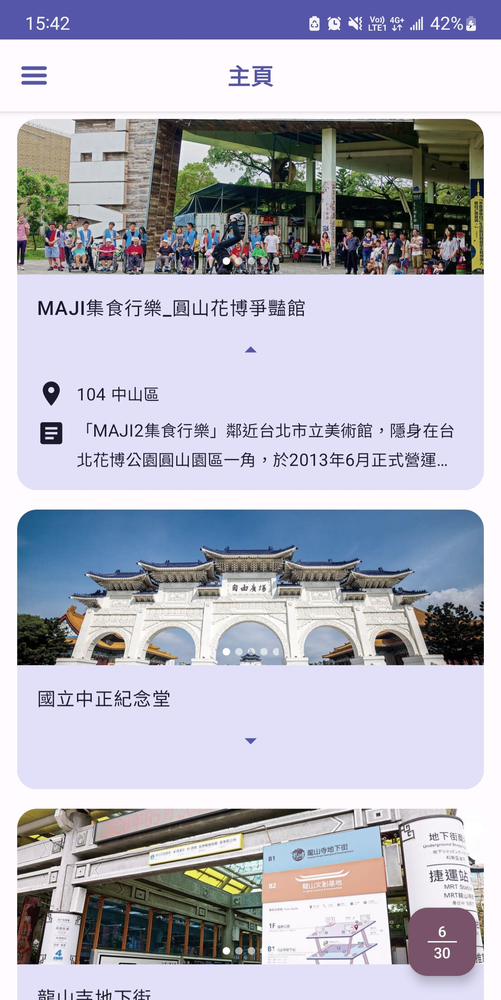
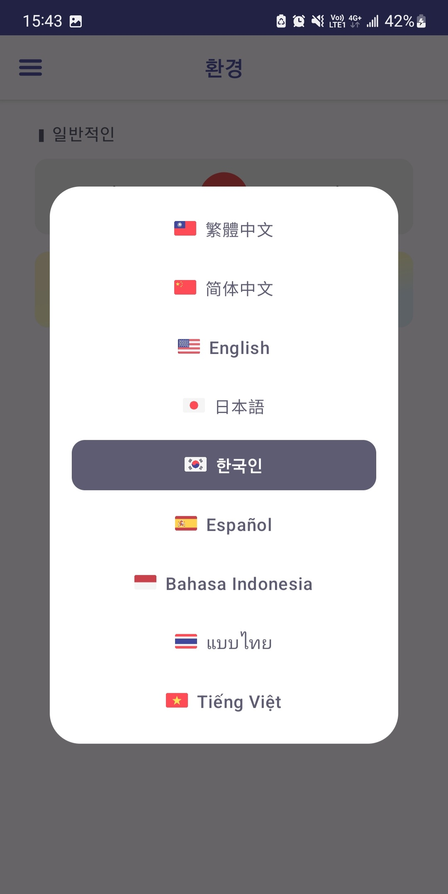
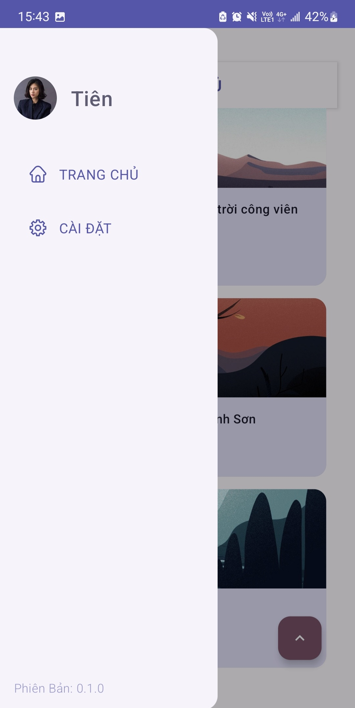

# TaipeiTour
- Hello Taipei, enjoy Taipei!
  

# Overview
- [專案介紹](#專案介紹)
- [主要畫面](#主要畫面)
- [程式碼檢查](#程式碼檢查)
- [開發環境](#開發環境)
- [REFERENCES](#REFERENCES)
- [備註](#備註)

## 專案介紹
- 使用 Jetpack Compose 進行介面開發
- 專案架構 MVVM 為主，部分參考：[Architecture Samples](https://github.com/android/architecture-samples "Android Architecture Samples")
- 使用 Flow 以及 coroutines 處理 asynchronous operations
- 使用 koin 作為 dependency injection
- 將 Open-API 的使用模組化[TaipeiTourApi](https://github.com/7ANG2C/TaipeiTour/tree/feature/prepare_readme/TaipeiTourApi "TaipeiTourApi")
- [PreviewFunctionFlavor] 在 debug/release 有不同實作，用以模擬區分 flavor/dimension 的開發方式
- 使用 [version catalogs](https://developer.android.com/build/migrate-to-catalogs "version catalogs") 搭配 [libs.versions.toml] 進行多模組版本管理

## 主要畫面

| 圖片                                                | 敘述                                                                                                                 |
|---------------------------------------------------|--------------------------------------------------------------------------------------------------------------------|
|       | 主頁 MainScreen - 卡片式列表 / 下拉刷新 / 上滑取更多 - 具備 錯誤&無資料 的畫面反饋處理 - 右下按鈕：向上滾 - 顯示當前進度 - 右下按鈕；向下滾 - 一件滑至頂端    |
|  | 單景點 AttractionFragment - Fragment 內使用 ComposeView - Collapse Toop Bar 動畫效果                              |
|   | 網頁景點 WebIntroductionScreen - 進行intent 轉導處理                                                                      |
|    | 設定 SettingScreen  - 更換語系時有 slide-fade 效果 - 提供 DarkMode / ColorScheme - Preview Function 在 debug 時提供更多設置 |
|   | 多語系彈窗                                                                                                           |
|            | 側邊欄 - 切換功能時，主畫面有 scale 效果                                                                                       |

## 程式碼檢查
- 使用 [spotless](https://github.com/diffplug/spotless "spotless") 檢查 code style
    - `./gradlew spotlessCheck` 檢查程式碼
    - `./gradlew spotlessApply` 修正程式碼

## 開發環境
- Android Studio Giraffe | 2022.3.1
- Build #AI-223.8836.35.2231.10406996, built on June 29, 2023
- Runtime version: 17.0.6+0-17.0.6b829.9-10027231 aarch64
- VM: OpenJDK 64-Bit Server VM by JetBrains s.r.o.
- macOS 12.6 | Memory: 4096M | Cores: 8

## REFERENCES
- [Travel-Taipei Open API](https://www.travel.taipei/open-api/swagger/ui/index#/ "travel-taipei-open-api")
- [Material3 Theme Builder](https://m3.material.io/theme-builder#/custom "md3-theme-builder")

## 備註
- [設計稿](https://www.figma.com/file/XZ3fJaUESt5pWt8JuAoxey/TaipeiTour?type=design&node-id=0-1&mode=design "Figma")
- [Demo](https://www.youtube.com/watch?v=i3aD9Is7a2U "Youtube")
  - 手機規格 : SAMSUNG Galaxy Note 10+ (Android 12)
- 估時
  | 0727 | 0728 | 0729 | 0730 | 0731 | 0801 | 0802 | / |
  | - | - | - | - | - | - | - | - |
  | 規劃 規劃 | 二 | 二 | 二 | 二 | 三 | 四 | 共 48 hr |
  | 0803 | 0804 | 0805 | 0806 | 0807 | / | / | / |
  | 一 | 二 | 二 | 二 | 二 | / | / | 共 48 hr |
- 備註 目前多語系的部分，id是錯的
  

[PreviewFunctionFlavor]: ./app/src/main/java/com/fang/taipeitour/flavor/PreviewFunctionFlavor.kt
[libs.versions.toml]: ./gradle/libs.versions.toml
