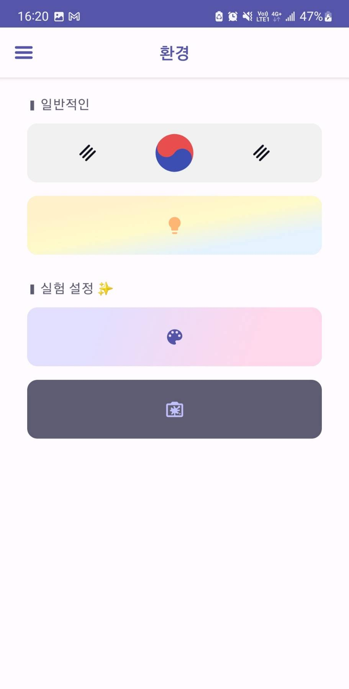
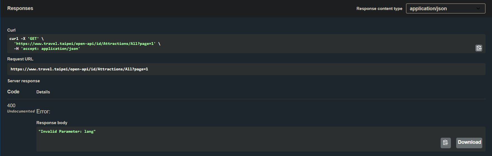

# Overview
- [專案介紹](#專案介紹)
- [主要畫面](#主要畫面)
- [程式碼檢查](#程式碼檢查)
- [開發環境](#開發環境)
- [REFERENCES](#REFERENCES)
- [備註](#備註)

## 專案介紹
- 使用 Jetpack Compose 進行介面開發
- 專案架構 MVVM 為主，部分參考：[Architecture Samples](https://github.com/android/architecture-samples "Android Architecture Samples")
- 使用 Flow 以及 coroutines 處理 asynchronous operations
- 使用 koin 作為 dependency injection
- 將 Open-API 的使用模組化 [TaipeiTourApi](https://github.com/7ANG2C/TaipeiTour/tree/feature/prepare_readme/TaipeiTourApi "TaipeiTourApi")
- [PreviewFunctionFlavor] 在 debug/release 有不同實作，用以模擬區分 flavor/dimension 的開發方式
- 使用 [version catalogs](https://developer.android.com/build/migrate-to-catalogs "version catalogs") 搭配 [libs.versions.toml] 進行多模組版本管理

## 主要畫面

| 圖片                                                | 敘述                                                                                                                                                  |
|---------------------------------------------------|-----------------------------------------------------------------------------------------------------------------------------------------------------|
|       | 主頁 MainScreen - 卡片式列表 / 下拉刷新 / 上滑取更多 - 具備 錯誤&無資料 的畫面反饋處理 - 如果沒有圖片資源，會自動以 place holder 填補 - 右下按鈕：向上滾 - 顯示當前進度 - 右下按鈕：向下滾 - 一鍵滑至頂端 |
|  | 單景點 AttractionFragment - Fragment 內使用 ComposeView - Collapse Top Bar 動畫效果 - 景點資訊如電話等，能夠點擊轉導至相關應用程式                                       |
|   | 網頁景點 WebIntroductionScreen - Uri 轉導處理 - 可供下載檔案 (DownloadManager) - 位置權限請求處理                                                              |
|    | 設定 SettingScreen  - 更換語系時有 slide-fade 效果 - 提供 DarkMode Switch - Preview Function 在 debug 時提供更多設置                                         |
|   | 多語系彈窗                                                                                                                                            |
|            | 側邊欄 - 切換功能時，主畫面有 scale 效果                                                                                                                        |
- 使用 DataStore 取代 SharedPreferences 進行資料永久儲存
- 使用 [coil](https://developer.android.com/jetpack/compose/graphics/images/loading#coil "coil") 進行圖片讀取

## 程式碼檢查
- 使用 [spotless](https://github.com/diffplug/spotless "spotless") 檢查 code style
    - `./gradlew spotlessCheck` 檢查程式碼
    - `./gradlew spotlessApply` 修正程式碼

## 開發環境
- Android Studio Koala Feature Drop | 2024.1.2
- Build #AI-241.18034.62.2412.12266719, built on August 23, 2024
- Runtime version: 17.0.11+0-17.0.11b1207.24-11852314 aarch64
- VM: OpenJDK 64-Bit Server VM by JetBrains s.r.o.
- macOS 13.5 | Memory: 3072M | Cores: 8

## REFERENCES
- [Travel-Taipei Open API](https://www.travel.taipei/open-api/swagger/ui/index#/ "travel-taipei-open-api")
- [Material3 Theme Builder](https://m3.material.io/theme-builder#/custom "md3-theme-builder")

## 備註
- 開發時間表 (2024)
  | 0727 | 0728 | 0729 | 0730 | 0731 | 0801 |
  | - | - | - | - | - | - |
  | 確認規格 規劃實作方式 | 專案建置 服務串接 ImageSlider 實作 | 主頁實作 DataStore 建置 Flavor 建置 | 研究動畫 依賴版本更新 | Drawer 實作 單景點頁面實作 部分頁面動畫實作 | 單景點頁面實作 UserPreferences 建置 |
  | 0802 | 0803 | 0804 | 0805 | 0806 | 0807 |
  | 完善主頁資料流 | 設定頁實作 國旗刻劃 | WebView實作 研究地圖渲染 | 測試研究與撰寫 | 專案審視整理 Splash、Icon...等 | 文件撰寫與整理 影片錄製 |
- 目前 `GET/{lang}/Attractions/All` 在語系為印尼時 request fail (最後測試時間為 2024-12-02)
  
- [cover figma](https://www.figma.com/file/XZ3fJaUESt5pWt8JuAoxey/TaipeiTour?type=design&node-id=0-1&mode=design "Figma")

[PreviewFunctionFlavor]: ./app/src/main/java/com/fang/taipeitour/flavor/PreviewFunctionFlavor.kt
[libs.versions.toml]: ./gradle/libs.versions.toml
